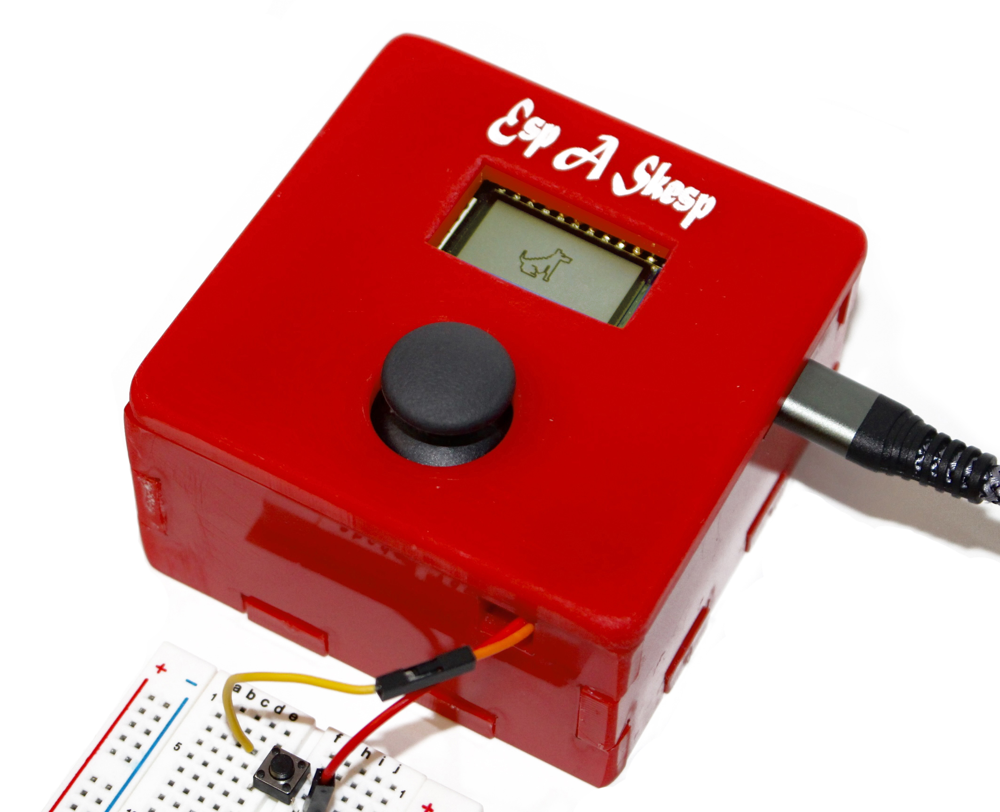
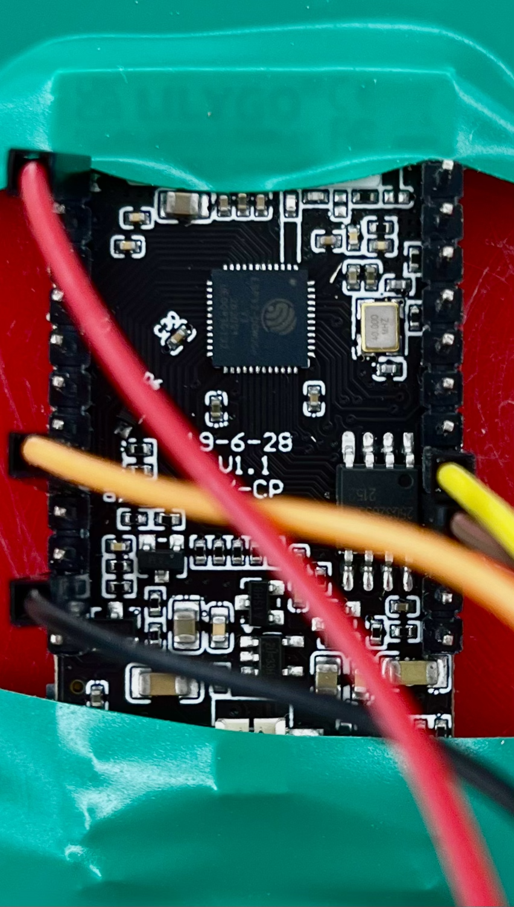
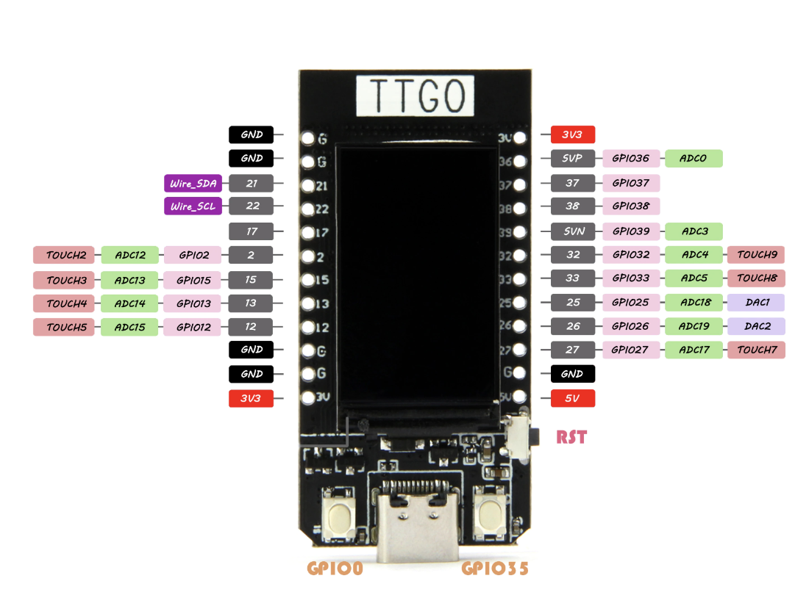

# sketchy

*(COMS 3930: Module 2) Interactive devices for the ESP32 TTGO T-Display*

A program that reads input from a joystick and a button and writes on the
screen, like an Etch-A-Sketch. The joystick moves the "cursor" on the screen,
and pressing the button clears the screen.



## Getting started with the Arduino IDE

This program is written in Arduino so we'll work with the
[Arduino](https://www.arduino.cc) IDE. Download the Arduino IDE
[here](https://www.arduino.cc/en/software), then follow these steps to run code
on an ESP32:

1. In `Preferences`, paste the following link into `Additional boards manager
URLs`:

```
https://dl.espressif.com/dl/package_esp32_index.json
```

2. In `Tools > Boards > Boards Manager`, search for "esp32". There should be
one result, "esp32 by Espressif Systems"—install it.

3. Select the ESP32 board by clicking `Tools > Boards > esp32 > TTGO T1`.

4. In `Tools > Manage Libraries`, search for "TFT_eSPI Bodmer". Install the one
with the title "TFT_eSPI".

5. In `Preferences`, copy the filepath specified under "Sketchbook location".
`cd` into that directory in your terminal/terminal emulator. There should be a
`libraries` directory in there. `cd libraries/TFT_eSPI`, then open
`User_Setup_Select.h` with a text editor. In this file, there should be lines
like this:

```c
#include <User_Setup.h>           // Default setup is root library folder

...

//#include <User_Setups/Setup25_TTGO_T_Display.h>    // Setup file for ESP32 and TTGO T-Display ST7789V SPI bus TFT
```

Uncomment the second line, and comment the first:

```c
//#include <User_Setup.h>           // Default setup is root library folder

...

#include <User_Setups/Setup25_TTGO_T_Display.h>    // Setup file for ESP32 and TTGO T-Display ST7789V SPI bus TFT
```

Now, you should be ready to run code on your ESP32!

## Hardware

I used 7 wires, 5 female-to-female and 2 female-to-male. For the joystick, I
connected ground on the joystick to ground on the ESP32 (black wire), 5V to a
3V3 pin (red wire), VRX to pin 13 (yellow), VRY to pin 12 (brown), and SW to
pin 25 (orange):

<div class="row">
    
    
</div>

You can switch up the pins for X, Y, and SW, but X and Y must be ADC pins. The
button connects to the ESP32 with two wires: one to ground and one to pin 15. I
used all female-to-female wires for the joystick as a design choice, since I
was enclosing the devices in a small box.

## Running the code

Connect your ESP32 via a USB-C cable to one of the ports on your computer. Open
`sketchy.ino` (inside `sketchy/`) with the Arduino IDE, and click the arrow
button in the top left corner of the IDE to upload the code to the ESP32.

> **Note**
> I had some difficulty getting code to export from my Mac. If your compilation is
> failing with an error message that ends with `A fatal error occurred: Failed
> to write to target RAM`, try following the steps in
> [this issue comment.](https://github.com/Xinyuan-LilyGO/LilyGo-T-Call-SIM800/issues/139#issuecomment-904390716)